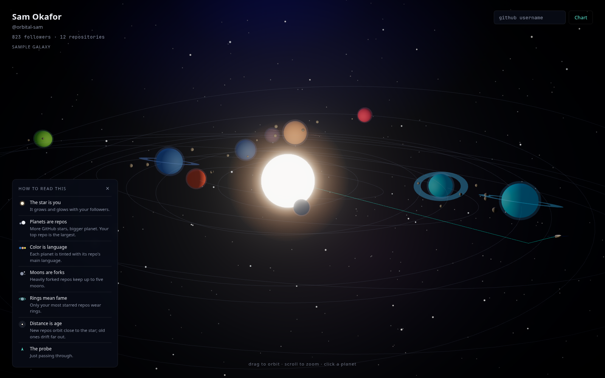

# GitHub Galaxy

Your GitHub profile as a calm, deterministic 3D solar system in the browser.



## Setup

```bash
npm install
npm run dev
```

That is all. The app opens on a bundled sample profile, and entering any GitHub username charts that account through the anonymous REST API. No token, no configuration.

## Data sources and the optional token

Two interchangeable sources sit behind one interface:

- **Anonymous (default).** The REST API, which allows unauthenticated requests: about 60 lookups per hour per IP and 10 searches per minute. This is what a public deployment uses, so no secret ever ships to the browser. When the limit runs out the app says so and stays on whatever galaxy is on screen. One quirk: the search endpoint omits repos with no commits, so empty scaffolds do not appear.
- **Token (local option).** Copy `.env.example` to `.env`, set `VITE_GITHUB_TOKEN` (classic token, no scopes needed), and restart. This switches to GraphQL: one request per profile, 5000 points per hour, and GitHub's exact language colors.

Security notes:

- `.env` is gitignored; never commit a token.
- Do not set `VITE_GITHUB_TOKEN` in a public build. A Vite env var is inlined into the shipped JavaScript where anyone can read it. The anonymous source exists precisely so deployments need no token.
- If you ever paste a token anywhere outside `.env`, rotate it.

## Deploying to GitHub Pages

The repo ships a workflow at `.github/workflows/deploy.yml`. One-time setup:

1. Push the repo to GitHub.
2. In the repo settings, under Pages, set **Source** to **GitHub Actions**.
3. Push to `main` (or `master`), or run the workflow manually.

The workflow tests, lints, builds with the correct `--base` path for project pages, and deploys `dist/`. It intentionally provides no token; the deployed site runs on the anonymous source.

## How the mapping works

Every visual maps to a real metric. A repository is a planet: its size follows stars (log scaled and normalized against your own top repo, so small profiles still read well), its tint is GitHub's color for the primary language, moons are forks, and rings appear on highly starred repos. Orbit distance follows repo age, newest close in, so the system reads chronologically from the center outward, and each planet traces a faint orbit guide. The central star is you: its size and glow follow followers. Forked and archived repos are excluded by default, and only the top 60 repos become full planets; the rest render as faint distant specks. A lone survey probe cruises the system on a seeded route; it means nothing and stays anyway.

Controls: drag to orbit, scroll to zoom, click a planet for details, click empty space to return. The camera drifts on its own after a few idle seconds.

## Determinism

All procedural placement (orbit angles, inclinations, speeds, the background starfield) is seeded from the username via FNV-1a plus mulberry32, in `src/lib/prng.ts`. `Math.random` is never used in scene generation, so the same login always produces the same galaxy. Background star density quantizes account age to whole years so it is stable across reloads.

## Commands

| Command          | What it does                                   |
| ---------------- | ---------------------------------------------- |
| `npm run dev`    | Start the dev server                           |
| `npm run build`  | Type-check then build for production           |
| `npm test`       | Unit tests (PRNG, math, mapping, REST adapter) |
| `npm run lint`   | ESLint                                         |
| `npm run format` | Prettier                                       |

## Notes

- Verified against current docs: React Three Fiber 9 pairs with React 19, drei 10 pairs with fiber 9, and the postprocessing chain runs ACES Filmic tone mapping once, as the last effect, with the Canvas in `flat` mode.
- Bloom is selective by luminance: the star pushes emissive color above 1 while planets stay under the threshold, so only the star and corona glow.
- `prefers-reduced-motion` disables the idle camera drift and slows ambient motion to near zero.
